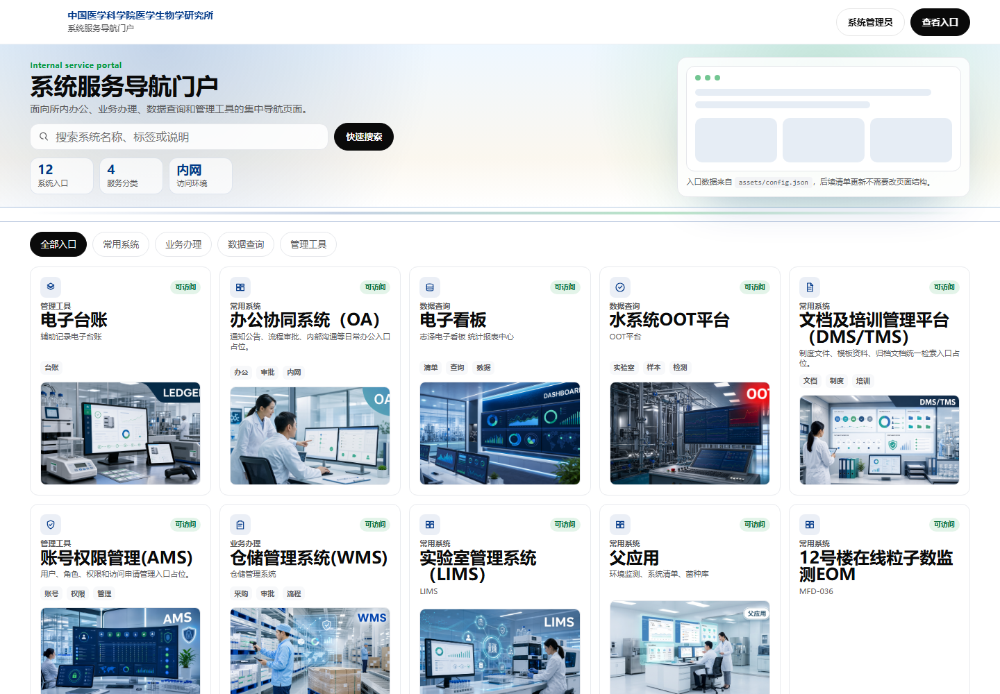
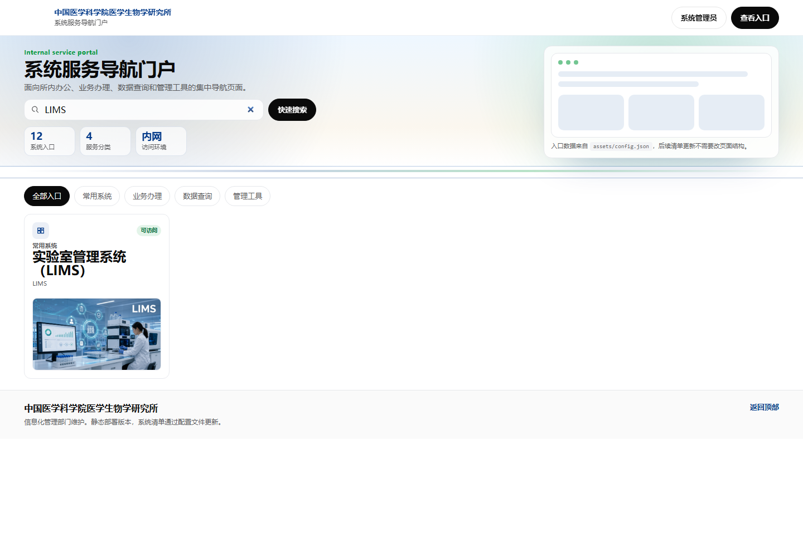
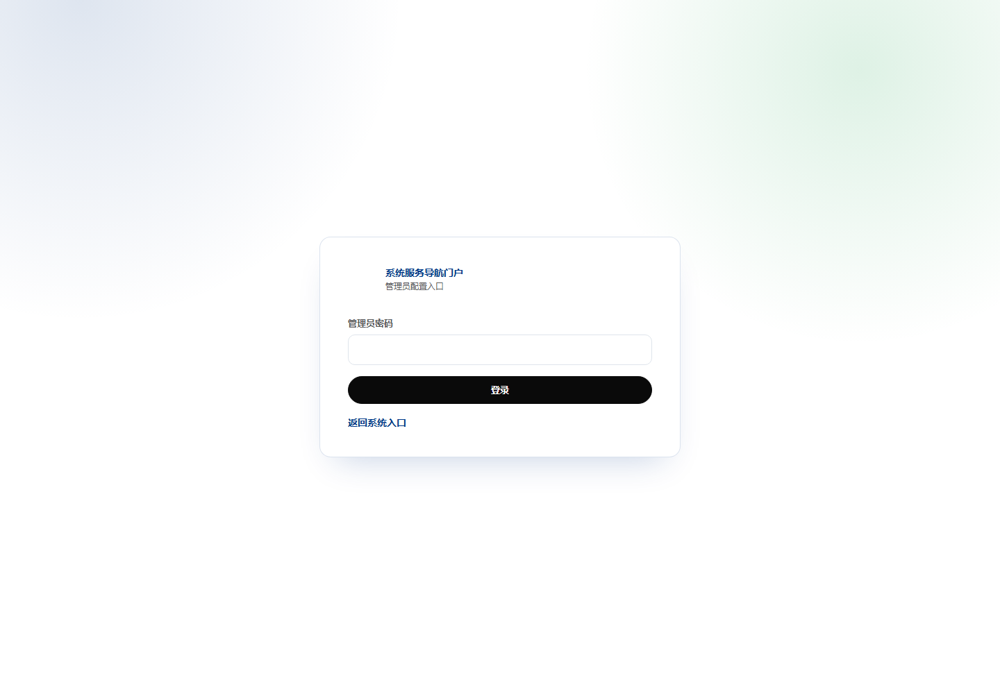
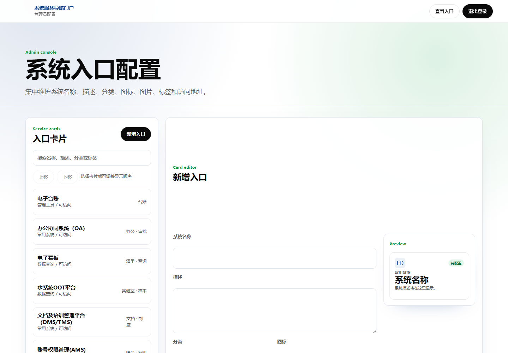
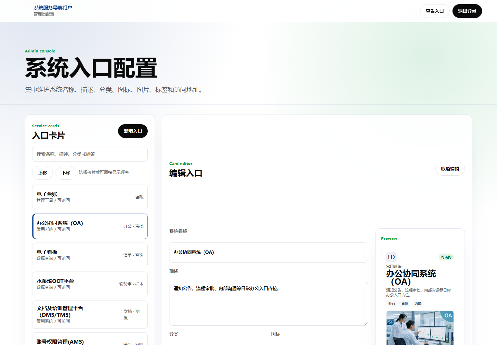

# 系统服务导航门户操作使用说明文档

## 1. 文档概述

本文档说明“系统服务导航门户”的访问、查询、跳转、后台登录、入口维护、图片上传、排序和退出登录等操作流程，可作为软件著作权申报中的用户操作说明材料。

本文档截图来自当前线上系统地址：`http://1958.cn/`。截图中已对页面顶部机构 logo 图片进行隐藏处理，保留页面文字和业务操作区域。

## 2. 使用对象

| 使用对象 | 使用内容 |
| --- | --- |
| 普通用户 | 访问门户首页，搜索、筛选和打开系统入口 |
| 系统管理员 | 登录后台，维护系统入口、图片、状态和显示顺序 |
| 运维人员 | 启动服务、配置管理员密码、检查配置文件和恢复备份 |

## 3. 访问入口

| 页面 | 地址 | 说明 |
| --- | --- | --- |
| 前台门户 | `http://1958.cn/` | 普通用户访问入口 |
| 管理后台 | `http://1958.cn/admin.html` | 管理员配置入口 |

系统推荐使用 Chrome、Edge、Firefox 等现代浏览器访问。

## 4. 前台门户使用说明

### 4.1 打开门户首页

1. 打开浏览器。
2. 在地址栏输入 `http://1958.cn/`。
3. 页面加载后显示门户名称、搜索框、概览指标、分类按钮和系统入口卡片。



### 4.2 查看系统入口

门户首页以卡片形式展示系统入口。每个入口通常包含系统名称、系统说明、所属分类、状态、标签、图片和跳转提示。

用户可以通过页面中的“系统入口”指标了解当前入口数量，通过“服务分类”了解系统分类数量，通过“访问环境”了解系统使用环境。

### 4.3 搜索系统入口

1. 点击首页搜索框。
2. 输入系统名称、标签或说明关键词。
3. 页面会自动显示匹配的系统入口。
4. 清空搜索框后恢复全部入口。



### 4.4 按分类筛选

1. 在入口目录上方选择分类按钮。
2. 可选择“全部入口”“常用系统”“业务办理”“数据查询”“管理工具”等分类。
3. 页面会显示当前分类下的入口卡片。

### 4.5 打开业务系统

1. 在门户页面找到需要访问的系统卡片。
2. 点击可访问的卡片。
3. 浏览器会在新窗口或新标签页中打开对应业务系统。

如果入口地址尚未配置，卡片会显示“地址待配置”或不能跳转，需要管理员在后台补充访问地址。

## 5. 管理后台使用说明

### 5.1 打开管理后台

1. 在浏览器中访问 `http://1958.cn/admin.html`。
2. 页面显示管理员登录入口。
3. 输入管理员密码。
4. 点击“登录”。



管理员密码由系统运维或信息化管理人员统一维护，本文档不记录真实密码。

### 5.2 后台主界面

登录成功后进入“系统入口配置”页面。页面主要分为三部分：

1. 顶部导航区：可返回前台入口或退出登录。
2. 入口卡片列表：显示已有系统入口，支持搜索和排序。
3. 编辑表单区：新增或编辑系统入口信息，并显示实时预览。



### 5.3 新增系统入口

1. 点击“新增入口”。
2. 填写“系统名称”。
3. 填写“描述”。
4. 选择“分类”。
5. 选择“图标”。
6. 上传图片或保留为空。
7. 填写“访问地址”。暂未确定地址时可填写 `#`。
8. 选择“状态”，例如“可访问”“待配置”“维护中”。
9. 填写“标签”，多个标签用英文逗号分隔。
10. 点击“新增入口”保存。

保存后，系统会将配置写入 `assets/config.json`，前台页面刷新后显示新增入口。

### 5.4 编辑系统入口

1. 在左侧入口卡片列表中点击需要编辑的系统。
2. 右侧表单会自动填充该系统的当前配置。
3. 根据需要修改名称、描述、分类、图标、图片、访问地址、状态或标签。
4. 右侧预览区域会展示接近前台卡片的效果。
5. 点击“保存修改”。



### 5.5 删除系统入口

1. 在入口列表中选择需要删除的系统。
2. 点击“删除入口”。
3. 在浏览器确认框中确认删除。
4. 删除后配置自动保存，前台刷新后不再显示该入口。

删除入口只影响门户展示，不会删除被跳转的外部业务系统。

### 5.6 调整显示顺序

1. 在入口列表中选择某个系统入口。
2. 点击“上移”或“下移”。
3. 系统会保存新的排序结果。

注意：后台搜索状态下不可调整顺序，需要先清空搜索框。

### 5.7 上传入口图片

1. 在新增或编辑表单中找到“图片”区域。
2. 点击“上传本地图片”。
3. 选择 jpg、png、webp 或 gif 格式图片。
4. 上传成功后，图片路径会自动写入表单。
5. 点击保存后，前台入口卡片展示该图片。

### 5.8 删除入口图片

1. 选择已有图片的系统入口。
2. 点击“删除图片”。
3. 系统删除上传图片并清空图片字段。
4. 点击保存后，前台入口卡片不再显示该图片。

### 5.9 退出登录

1. 点击后台右上角“退出登录”。
2. 系统清除当前会话。
3. 页面返回登录状态。

## 6. 运维操作说明

### 6.1 启动服务

Python 启动示例：

```bash
cd /var/www/service-portal
PORT=80 ADMIN_PASSWORD=管理员密码 python server.py
```

Node.js 启动示例：

```bash
cd /var/www/service-portal
ADMIN_PASSWORD=管理员密码 npm start
```

### 6.2 配置管理员密码

管理员密码通过环境变量 `ADMIN_PASSWORD` 配置。请勿将真实密码写入源代码、配置文件、公开文档或版本库。

### 6.3 配置文件维护

系统入口数据保存在 `assets/config.json` 中。推荐通过后台页面维护配置。手动修改配置文件时，应注意：

1. 修改前备份原文件。
2. 保持 JSON 格式合法。
3. 确保每个系统入口包含 `id`、`name`、`description`、`category`、`url` 等字段。
4. 修改后刷新前台页面验证展示效果。

### 6.4 备份恢复

后台每次保存配置时，会在 `data/backups/` 目录下生成配置备份。恢复步骤如下：

1. 停止服务或暂停后台编辑。
2. 从 `data/backups/` 选择需要恢复的备份文件。
3. 将备份文件复制为 `assets/config.json`。
4. 重启服务或刷新页面。
5. 检查系统入口是否恢复。

## 7. 常见问题

### 7.1 前台页面加载失败

可能原因：

1. 服务未启动。
2. `assets/config.json` 不存在或格式错误。
3. 浏览器无法访问服务器地址。

处理方式：

1. 检查服务进程。
2. 检查配置文件 JSON 格式。
3. 查看浏览器控制台和服务端日志。

### 7.2 后台无法登录

可能原因：

1. 管理员密码输入错误。
2. 服务器未配置 `ADMIN_PASSWORD`。
3. 服务重启后原会话失效。

处理方式：

1. 确认当前管理员密码。
2. 检查服务环境变量。
3. 重新登录后台。

### 7.3 图片上传失败

可能原因：

1. 图片格式不支持。
2. 图片文件过大。
3. `assets/uploads/` 目录没有写入权限。

处理方式：

1. 使用 jpg、png、webp 或 gif 格式图片。
2. 压缩图片后重新上传。
3. 检查服务器目录权限。

### 7.4 保存入口失败

可能原因：

1. 必填字段为空。
2. 访问地址格式不符合要求。
3. 配置文件无写入权限。

处理方式：

1. 补充系统名称、描述和分类。
2. 使用合法 HTTP 地址、HTTPS 地址或相对路径。
3. 检查项目目录权限。

## 8. 注意事项

1. 管理员密码应由运维人员统一保管，不应写入文档或仓库。
2. 多名管理员不宜同时编辑配置，避免后保存内容覆盖先保存内容。
3. 删除入口前应确认该入口不再需要展示。
4. 上传图片应选择清晰、合规、与系统相关的图片。
5. 应定期保留重要配置备份。

## 9. 结论

系统服务导航门户通过前台入口目录和后台配置管理功能，实现了内部系统入口的集中展示和维护。普通用户可以通过搜索、分类和卡片跳转快速访问业务系统；管理员可以通过后台完成入口新增、编辑、删除、排序和图片维护，满足内网系统导航场景的日常使用要求。
